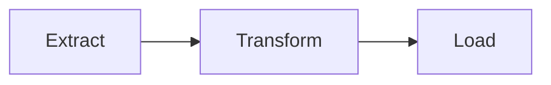

# Documentation — built alongside the code, not after

## Core principle: docs are part of "done", by default, like TDD

- This is a default behavior, not an opt-in step requested per task — exactly like TDD: nobody has to ask "write tests for this", and the same standing expectation applies to docs. Writing/updating docs is part of completing a feature, automatically, every time, without being asked.
- Documentation is not a separate phase done at the end. A feature isn't "done" until its docs are written; a code change isn't "done" until the docs it affects are updated — same commit/PR, never "I'll document it later".
- If a function/module/endpoint's behavior changes, every doc describing that behavior must be updated in the same change — docstring, README section, `docs/*` file, project CLAUDE.md if relevant. A stale doc is worse than no doc (false confidence) — if a doc can't be updated for any reason, flag it explicitly rather than leaving it silently wrong.
- Use the `write-docs` skill to actually write/fix documentation, and `audit-docs` periodically to check for gaps that slipped through — see `~/.claude/skills/`.

## Folder structure & community conventions

Standard files at the project root (omit only if genuinely not applicable — flag if skipped):

| File | Purpose |
|---|---|
| `README.md` | One-liner + quickstart (install + run in under 5 commands) + links to deeper docs |
| `CLAUDE.md` | Project-specific context for AI assistants — never repeats the global one (see `rules/common/repo-structure.md`) |
| `CONTRIBUTING.md` | For any collaborative project (group work, junior-entreprise): branch/PR workflow, commit convention, how to run tests locally before pushing |
| `CHANGELOG.md` | Once the project has releases/tags — [Keep a Changelog](https://keepachangelog.com) format |
| `.env.example` | Every documented env var, with a one-line comment on what it's for |
| `docs/` | Anything beyond what fits comfortably in the README — organized by topic, never a single dump file |

`docs/` layout once it exists (adapt names to the project, keep the split):

```
docs/
├── architecture.md     # high-level design: components, data flow, key decisions and why
├── setup.md             # full installation/setup guide beyond the README quickstart
├── testing.md           # how to run tests, write new ones, coverage expectations
├── deployment.md        # build/deploy/run in production if applicable
└── decisions/           # ADRs (Architecture Decision Records) for significant, hard-to-reverse choices, one file per decision
```

Don't create a `docs/` subfile for a topic that's only a paragraph — fold it into the README or the closest existing file instead. One focused file per real topic, not one file per heading.

## What lets a developer ramp up fast

A developer should be able to go from "cloning the repo" to "running the project locally" using only the README + linked docs — no tribal knowledge, no asking a teammate for an undocumented step.

Minimum required, regardless of project size:
- **Install**: prerequisites (language version, system deps), exact commands, expected result at each step
- **Run**: how to start the project locally, with realistic example commands (not "configure as needed")
- **Test**: how to run the test suite, how to run a single test, expected coverage
- **Build/deploy**: if the project ships somewhere (Docker image, package, deployed service) — exact commands
- **Architecture overview**: once the project has more than a handful of modules — where things live and why, not just a file tree dump

For an existing project missing one of these, flag it and propose adding it rather than assuming it's intentionally absent.

## Docs must work for AI assistants too, not just humans

Most developers now use an AI assistant day to day. A doc structure that only works when a human patiently reads five files in the right order fails the AI too — and a developer whose AI only has half the project's context produces worse results without realizing it.

- **Single source of truth per topic.** Never duplicate the same explanation in two files — link to the canonical one instead. Duplicated docs drift out of sync, and an AI reading only one of the two copies gets a partial or contradictory picture.
- **Self-contained files.** Each `docs/*.md` file should make sense on its own, without requiring the reader (human or AI) to have already read three other files to follow it. Cross-link explicitly when context from another file is genuinely needed.
- **One clear entry point.** The README must link to every other doc file that matters — nothing important should be discoverable only by stumbling on it with `find`. An AI assistant building context from the repo should be able to reach full project understanding by starting at the README and following links, not by guessing which files exist.
- **Decisions and business rules belong in a doc file, not only in someone's head or a commit message.** If a non-obvious choice was made (why this library, why this data model, why this trade-off), write it down in `docs/decisions/` or the relevant doc — an AI assistant has no access to the conversation that led to the decision unless it's written down.
- **Consistent, predictable structure across files** (same heading pattern, same file naming convention) — both humans and AI tools parse predictable structure faster than ad hoc layouts.

## Docstrings — complete, standardized, in English

- **Every public module, class, and function gets a docstring** — no exceptions for "it's obvious", because the obviousness is for the author, not for the next reader (human or AI) without the same context.
- **Format: Google-style docstrings for Python** (chosen for being the most widely supported by tooling — Sphinx napoleon, mkdocstrings, IDE rendering — and the most compact while staying structured). Stay consistent with this format across the whole codebase; don't mix styles (Google/NumPy/reST) within a project.
- A complete docstring includes, when relevant to the function (skip a section if it has nothing to say, never leave a section as a placeholder):
  - One-line summary (imperative mood: "Compute the total", not "Computes the total")
  - Longer description if the one-liner isn't enough to explain *why*, not just *what*
  - `Args:` — one line per parameter, semantics not just a type restatement (the signature's type hint already gives the type)
  - `Returns:` — what's returned and its meaning, not just its type
  - `Raises:` — exceptions the caller should expect and when
  - `Example:` — when usage isn't obvious from the signature alone (especially for public API entry points)
- **Trivial private one-liner functions** (name fully self-explanatory, no surprising behavior) can stay undocumented, consistent with `rules/common/coding-style.md` ("a name that needs a comment is a bad name") — but this is the exception, not the default; when in doubt, document.
- Docstrings are in English always (see the language rule in `rules/common/coding-style.md`), regardless of conversation language.
- Google-style is the standard for Python, the main stack with detailed tooling here. For any other language, follow that ecosystem's own established documentation convention instead (e.g. JSDoc/TSDoc for JS/TS, rustdoc for Rust, godoc for Go) — the principle is "the community standard for the tech in use," Google-style is just the current instantiation for Python, not a one-size-fits-all format imposed on every language.

## Diagrams — Mermaid.js when a picture outperforms text

A diagram is justified when it replaces several paragraphs of prose that would still leave the reader reconstructing a mental model. It is not justified when a short paragraph or a code snippet already makes the point clearly.

**Use a Mermaid diagram when:**
- **Architecture overview** (`docs/architecture.md`): component boundaries, service interactions, data flow across more than 2–3 modules — a `graph TD` or `C4Context` diagram beats a bullet list every time.
- **Sequence / protocol**: multi-step interactions between actors (API calls, auth flows, pipeline stages) — `sequenceDiagram` makes the ordering unambiguous without enumerating 10 numbered steps.
- **State machine**: an entity with multiple states and guarded transitions (`stateDiagram-v2`) — state tables are harder to scan than a visual graph.
- **Class hierarchy / domain model**: when there are 4+ classes with non-trivial relationships — `classDiagram` documents the OOP design alongside the code.
- **Data pipeline / ETL flow**: extraction → transformation → load stages with branching — `flowchart LR` makes the topology immediately readable.
- **ADRs in `docs/decisions/`**: if the decision involves a before/after architecture, add both diagrams; they make the trade-off visceral in a way prose can't.

**Do NOT add a diagram when:**
- A single sentence or a short list already communicates the same information clearly.
- The project has only 1–2 modules — a diagram would add complexity, not clarity.
- The diagram would just mirror the file tree (no topology, no interaction shown).

**Diagram type cheat sheet:**

| Situation | Mermaid type |
|---|---|
| General flow / architecture | `flowchart TD` / `flowchart LR` |
| Multi-actor interactions | `sequenceDiagram` |
| States & transitions | `stateDiagram-v2` |
| Class relationships | `classDiagram` |
| Timeline / Gantt | `gantt` |
| ER / data model | `erDiagram` |

**Validation with the Mermaid MCP:**
The `mcp__claude_ai_Mermaid_Chart__validate_and_render_mermaid_diagram` tool is available. Use it to validate any Mermaid block before including it in a doc — a syntax error in a diagram renders as a broken image, which is worse than no diagram. Always validate before considering the doc done.

**Format in Markdown:**
Always use a fenced code block with the `mermaid` language tag:

````markdown

````

Diagrams live in the doc file closest to what they describe — `docs/architecture.md` for the global picture, a specific `docs/decisions/` ADR for a localized one. Never create a `docs/diagrams/` folder that just holds `.md` files with diagrams and nothing else.

## Keeping docs from rotting

- A doc that contradicts the code is worse than a missing doc — if one is spotted while working on something else, fix it in the same change rather than filing it away as a separate task.
- Before trusting an existing doc for a non-trivial decision, sanity-check it against the actual code if the doc looks like it might predate a recent change.
- PR checklist (see the `pr-create` skill): "documentation updated if needed" is not optional boilerplate — actually verify it, don't just tick it.
